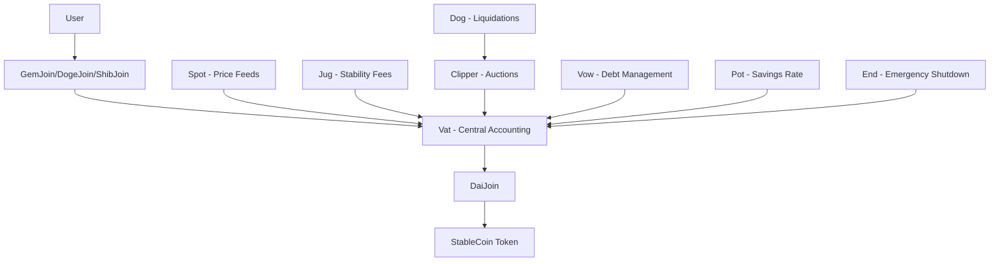

# USDog Stablecoin System

A comprehensive stablecoin system using **Dogecoin (DOGE)** and **Shiba Inu (SHIB)** as the only accepted collateral types on **Binance Smart Chain (BSC)**. Built on the battle-tested MakerDAO/Sky Ecosystem architecture.

## 🌟 Features

- **Multi-Collateral Support**: Accept both DOGE and SHIB as collateral on BSC
- **Chainlink Price Feeds**: Real-time price data from Chainlink oracles
- **Over-Collateralization**: Maintains stability through 150% collateralization ratio
- **Dutch Auction Liquidations**: Efficient price discovery for liquidated collateral
- **Savings Rate**: Earn yield on USDog holdings
- **Stability Fees**: Interest rates on borrowed USDog
- **Emergency Shutdown**: Global settlement mechanism for crisis situations
- **Batch Operations**: Multicall support for gas optimization
- **No Governance Token**: Simplified system without governance token complexity

## 🏗️ Architecture

### Core Components



### Smart Contracts

| Contract | Purpose | Description |
|----------|---------|-------------|
| **Vat.sol** | Central Accounting | Core system state and CDP management |
| **StableCoin.sol** | ERC-20 Token | The stablecoin token with mint/burn |
| **Join.sol** | Token Adapters | Bridge between tokens and core system |
| **Spot.sol** | Price Management | Oracle price feeds and safety margins |
| **Dog.sol** | Liquidation Trigger | Monitors and triggers liquidations |
| **Clip.sol** | Auction System | Dutch auction liquidation mechanism |
| **Jug.sol** | Stability Fees | Interest rate accumulation |
| **Vow.sol** | System Finances | Debt/surplus management |
| **Pot.sol** | Savings Rate | Yield for stablecoin holders |
| **End.sol** | Emergency Shutdown | Global settlement mechanism |

## 🚀 Quick Start

### Prerequisites

```bash
npm install -g hardhat
npm install
```

### Deploy to BSC

```bash
# Setup environment
cp .env.example .env
# Edit .env with your private key

# Deploy to BSC Testnet
npm run deploy:bsc-testnet

# Deploy to BSC Mainnet
npm run deploy:bsc
```

### Deploy to Local Network

```bash
# Start local hardhat network
npx hardhat node

# Deploy contracts (in another terminal)
npx hardhat run scripts/deploy.js --network localhost
```

### Run Tests

```bash
npx hardhat test
```

## 📖 Usage Guide

### 1. Creating a Collateralized Debt Position (CDP)

```javascript
// Example: Use 1000 DOGE to mint 50 USDog stablecoins

// 1. Approve DOGE transfer
await dogeToken.approve(dogeJoinAddress, parseEther("1000"));

// 2. Deposit DOGE collateral
await dogeJoin.join(userAddress, parseEther("1000"));

// 3. Create CDP and draw stablecoins
await vat.frob(
    formatBytes32String("DOGE-A"), // collateral type
    userAddress,                    // CDP owner
    userAddress,                    // collateral source
    userAddress,                    // stablecoin destination
    parseEther("1000"),            // collateral amount
    parseEther("50")               // stablecoin amount
);

// 4. Exit stablecoins to wallet
await daiJoin.exit(userAddress, parseEther("50"));
```

### 2. Using Multicall for Batch Operations

```javascript
// Create a CDP in a single transaction
const calls = await multicall.createCDPBatch(
    userAddress,
    vatAddress,
    dogeJoinAddress,
    daiJoinAddress,
    formatBytes32String("DOGE-A"),
    parseEther("1000"), // DOGE amount
    parseEther("50")    // Stablecoin amount
);

await multicall.aggregate(calls);
```

### 3. Earning with Savings Rate

```javascript
// Join the savings pot to earn yield
await pot.drip(); // Update savings rate
await pot.join(parseEther("100")); // Deposit 100 USDog

// Later, exit with accumulated interest
await pot.exit(parseEther("100"));
```

### 4. Liquidation Process

```javascript
// Liquidate an unsafe position
await dog.bark(
    formatBytes32String("DOGE-A"), // collateral type
    unsafeUserAddress,              // CDP to liquidate
    keeperAddress                   // liquidation incentive recipient
);

// Participate in auction
await clipper.take(
    auctionId,
    parseEther("100"),  // max collateral to buy
    maxPriceRay,        // max acceptable price
    buyerAddress,       // collateral recipient
    "0x"               // no callback data
);
```

## ⚙️ System Parameters

### Collateral Types

| Parameter | DOGE-A | SHIB-A | Description |
|-----------|--------|--------|-------------|
| **Token Address** | `0xba2ae424d960c26247dd6c32edc70b295c744c43` | `0x2859e4544c4bb03966803b044a93563bd2d0dd4d` | BSC token contracts |
| **Chainlink Feed** | `0x3AB0A0d137D4F946fBB19eecc6e92E64660231C8` | `0x804EaE4dcB6A8Db6ca2FC4d24005d8F38D9d19bA` | Price feed addresses |
| **Liquidation Ratio** | 150% | 150% | Minimum collateralization |
| **Stability Fee** | 2% APR | 2% APR | Interest on borrowed USDog |
| **Liquidation Penalty** | 10% | 10% | Fee on liquidated positions |
| **Debt Ceiling** | 10M | 10M | Maximum debt per collateral type |
| **Dust Limit** | 100 | 100 | Minimum debt per position |

### Global Parameters

- **Network**: Binance Smart Chain (BSC)
- **Total Debt Ceiling**: 50M USDog
- **Savings Rate**: 0% (configurable)
- **Emergency Shutdown Delay**: 24 hours

## 🛡️ Security Features

### Risk Management

1. **Over-Collateralization**: All positions must maintain 150% collateral ratio
2. **Liquidation System**: Automatic liquidation of unsafe positions
3. **Price Oracle Protection**: Multiple price feed sources with staleness checks
4. **Emergency Shutdown**: Global settlement mechanism for extreme scenarios

### Access Control

- **Administrative Functions**: Protected by `auth` modifier
- **Permission System**: Granular control over contract interactions
- **Upgradeable Components**: Individual contracts can be replaced via governance

## 🔧 Configuration

### Price Feeds

```javascript
// Update DOGE price feed
await spot.file(
    formatBytes32String("DOGE-A"),
    formatBytes32String("pip"),
    newPriceFeedAddress
);

// Update liquidation ratio
await spot.file(
    formatBytes32String("DOGE-A"),
    formatBytes32String("mat"),
    newLiquidationRatio
);
```

### System Parameters

```javascript
// Update stability fee (5% APR example)
const fivePercentAPR = "1000000001547125957863212448";
await jug.file(
    formatBytes32String("DOGE-A"),
    formatBytes32String("duty"),
    fivePercentAPR
);

// Update debt ceiling
await vat.file(
    formatBytes32String("DOGE-A"),
    formatBytes32String("line"),
    newDebtCeiling
);
```

## 📊 Monitoring & Analytics

### Key Metrics to Track

1. **System Health**
   - Total USDog debt outstanding
   - Collateralization ratio
   - Surplus/deficit

2. **Per-Collateral Metrics**
   - Debt utilization vs ceiling
   - Average collateralization ratio
   - Liquidation volume

3. **Economic Indicators**
   - Stability fee collection
   - Savings rate distribution
   - Auction participation

4. **BSC Integration**
   - Chainlink price feed updates
   - Gas costs and optimization
   - Cross-chain bridge monitoring (if applicable)

### Query Examples

```javascript
// Get system debt
const totalDebt = await vat.debt();

// Get collateral info
const dogeIlk = await vat.ilks(formatBytes32String("DOGE-A"));
console.log("DOGE debt:", dogeIlk.Art);
console.log("DOGE rate:", dogeIlk.rate);

// Get user position
const userVault = await vat.urns(formatBytes32String("DOGE-A"), userAddress);
console.log("Collateral:", userVault.ink);
console.log("Debt:", userVault.art);
```

## 🚨 Emergency Procedures

### Emergency Shutdown

```javascript
// Trigger emergency shutdown (admin only)
await end.cage();

// Process individual collateral types
await end.cage(formatBytes32String("DOGE-A"));
await end.cage(formatBytes32String("SHIB-A"));

// Users can then redeem USDog for proportional collateral
await end.pack(usdogAmount); // Convert USDog to claims
await end.cash(formatBytes32String("DOGE-A"), claimAmount); // Redeem for DOGE
```

## 🧪 Testing

### Run Test Suite

```bash
npm test
```

### Test Coverage

- **Unit Tests**: Individual contract functionality
- **Integration Tests**: Cross-contract interactions
- **Scenario Tests**: Complex user workflows
- **Edge Case Tests**: Liquidations, emergency shutdown

## 📝 Development

### Adding New Collateral Types

1. Deploy new `GemJoin` contract for the token
2. Initialize collateral type in `Vat`
3. Configure price feed in `Spot`
4. Set up liquidation in `Dog` and `Clipper`
5. Configure system parameters

### Upgrading Components

The system is designed for modularity. Individual components can be upgraded:

1. Deploy new contract version
2. Configure new contract
3. Update permissions (`rely`/`deny`)
4. Migrate state if necessary

## 🤝 Contributing

1. Fork the repository
2. Create a feature branch
3. Add tests for new functionality
4. Ensure all tests pass
5. Submit a pull request

## 📄 License

This project is licensed under AGPL-3.0-or-later.

## ⚠️ Disclaimer

This is experimental software. Use at your own risk. Always conduct thorough testing before deploying to mainnet.

---

## 🏆 Acknowledgments

Built on the foundation of the MakerDAO/Sky Ecosystem, one of the most battle-tested stablecoin architectures in DeFi. Special thanks to the MakerDAO community for creating such a robust and well-documented system.